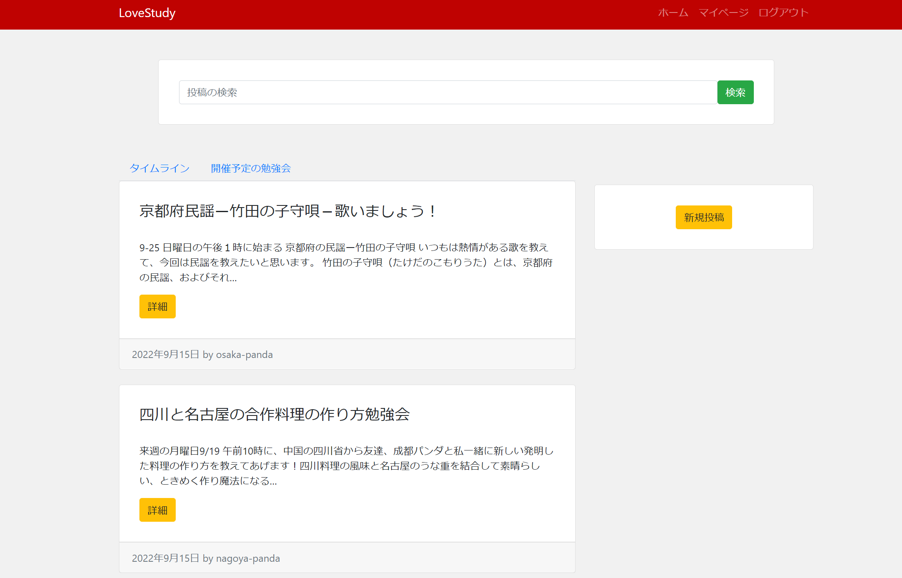
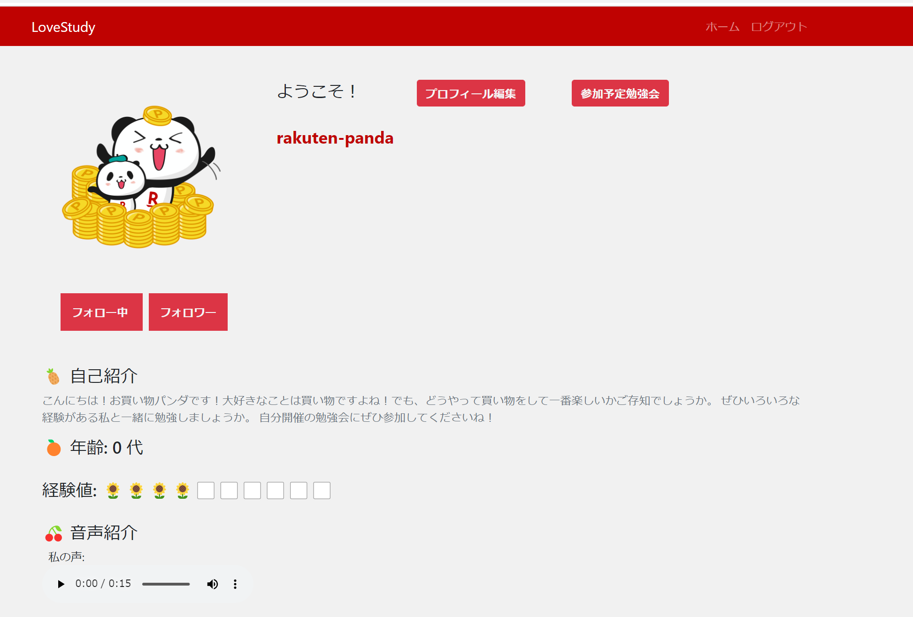
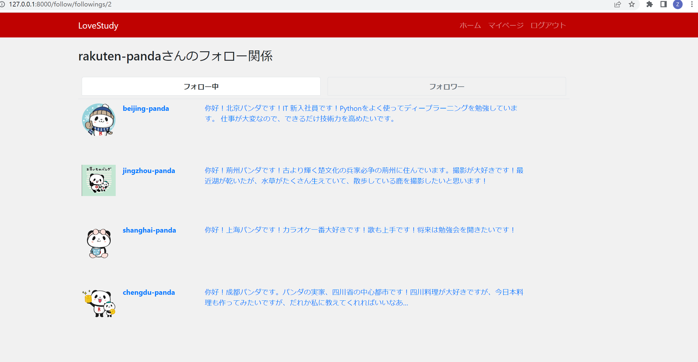
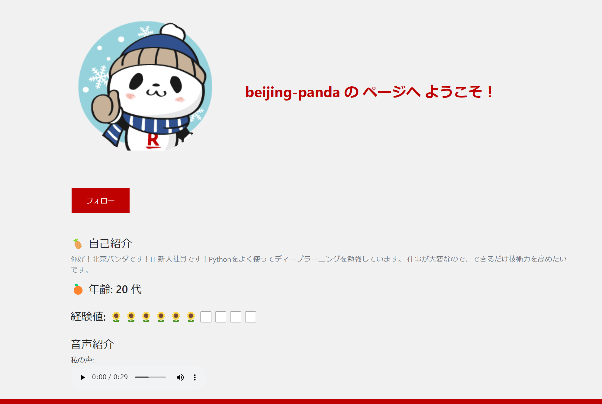

# Study Seminar Matching Web Application
- We, a team of 6 students,  created this project in Sep. 2022 in the internship of Rakuten Corp.
- By this app, users can post a study seminar with zoom links and contents, and they can search for their interested seminars.
- Other functions: post a post and comment, a page show seminars they plan to join, a page to register profile information, pages show following and follwers
- Dev tools: Boostrap (html,css) + Django, Python, SQLite
- Dev tools: Docker, Git, Selenium + WebDriver (test)


### Timeline
<div align=center></div>
<p align="center">Timeline</p>

### MyPage
<div align=center></div>
<p align="center">MyPage</p>

### follow page
<div align=center></div>
<p align="center">follow page</p>

### other users' page
<div align=center></div>
<p align="center">other users' page</p>

### deploy to AWS EC2
<div align=center></div>
<p align="center">the page acessed by public IP address</p>
- so it should revised to adapt to smartphone screen

### How to use
- I added 10 account users, so to see the demo, do not delete database
- use superuser to log in  to see the database
- superuser: zhu password: zhu123
- other account users
- username: rakuten-panda password: lovepy123
- other users we can see the followers page in the mypage after we log in by rakuten-panda user

- Docker:
```angular2html
sudo docker-compose up -d
sudo docker-compose ps -a
sudo docker start team9_server_1
sudo docker stop team9_server_1
docker-compose exec server bash
python manage.py runserver 0.0.0.0:8000
```
- for translation
- pip install -U deep-translator
- 
- for myself: I should access http://127.0.0.1:8000/home/
- 

#### my personal contribution
- Backend: 
- Implemented search box function and translation function
- Frontend:
- Implemented mypage (show personal information)
- Other:
- Integrated the
- Wrote test cases


- Git
```angular2html
git add .
git commit -m "commit for accounts"
git push origin accounts
```

- serverに移動し以下コマンドを実行
```
python manage.py runserver 0.0.0.0:8000
```

## migrations
- migrationsファイルを削除

- migrationsを行う
```
python manage.py makemigrations [specify directory-app/aacount/follow]
```

- migrationsを適用
```
python manage.py migrate
```
